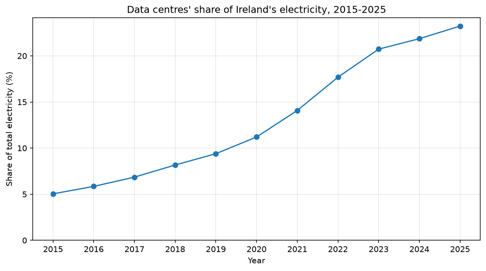
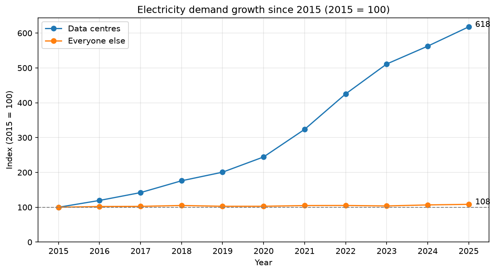
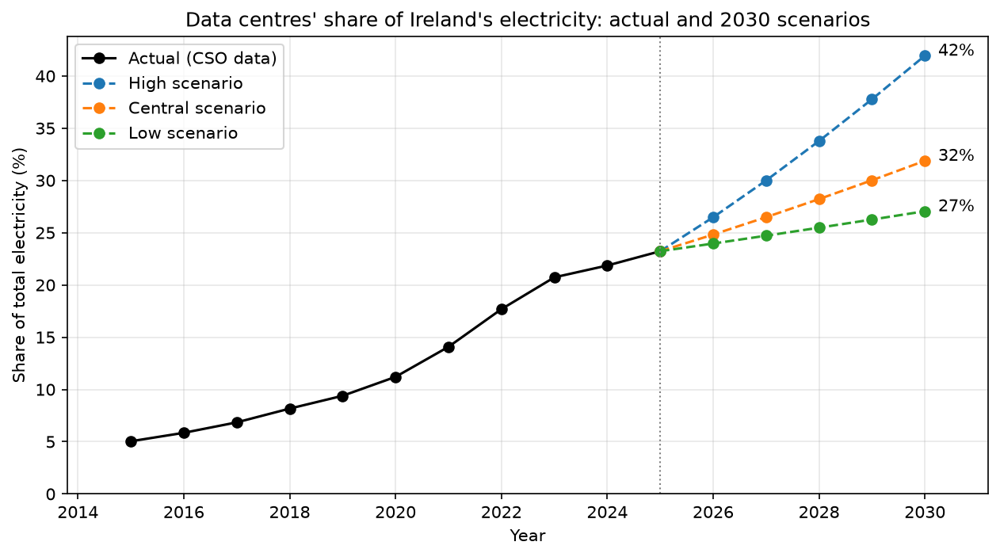
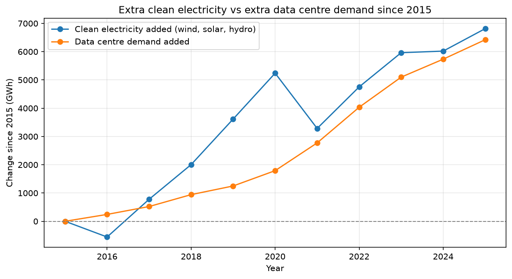

# Data Centre Power Analysis (Ireland, 2015-2025)

Analysis of how Irish data centre electricity demand has grown, where it is heading, and whether clean electricity is keeping up, using official CSO and SEAI data.

## Problem

Data centre electricity use in Ireland is growing much faster than everyone else's. This project answers three questions:

1. How fast is it really growing?
2. Where is it heading by 2030?
3. Can clean electricity (wind, solar, hydro) keep up?

## Key findings

- **Share of national electricity:** data centres went from 5.0% in 2015 to 23.2% in 2025.
- **Growth:** since 2015, data centre demand grew by about 518%, while all other users grew by about 8%.
- **Slowdown:** yearly growth peaked at 32% in 2021 and 2022, then fell to about 10% in 2024 and 2025. Demand is still rising every year.
- **2030 outlook:** under three growth scenarios, data centres would use 27% to 42% of Ireland's electricity by 2030, with a central estimate of about 32%.
- **Clean electricity:** from 2015 to 2025, data centres added 6,422 GWh of demand, equal to about 94% of the 6,814 GWh of new clean electricity. From 2020 to 2025, data centre demand grew about 3 times faster than clean supply.

## Charts

## Method

- Loaded quarterly CSO data, reshaped it to one row per quarter, and aggregated to yearly totals.
- Validated yearly totals against official CSO figures (within 1 GWh, due to quarterly rounding).
- Calculated yearly growth rates and 10-year compound annual growth (CAGR).
- Built three forecast scenarios to 2030 (5%, 10% and 20% yearly data centre growth).
- Extracted wind, solar and hydro production from 11 yearly sheets of SEAI's energy balance and converted ktoe to GWh.

## Limitations

- Only 11 years of data, so the forecast shows direction, not an exact number.
- The forecast assumes other users keep growing at 0.8% a year; electric cars and heat pumps could raise this and lower the data centre share.
- Electricity is shared on one grid, so the clean electricity comparison is an accounting comparison, not a claim about which source powers data centres.
- Wind output varies with the weather, and SEAI's 2025 figures are provisional.
- Biomass and other bio-renewables are not included in clean electricity.

## Data sources

- CSO, MEC02: Data Centres Metered Electricity Consumption, 2015-2025
- SEAI, National Energy Balance, 2015-2025 (2025 interim)

## Tools

Python, Pandas, Matplotlib, Jupyter, Git

## How to run

    pip install -r requirements.txt

Then open `notebooks/01_explore_data.ipynb` and run all cells.